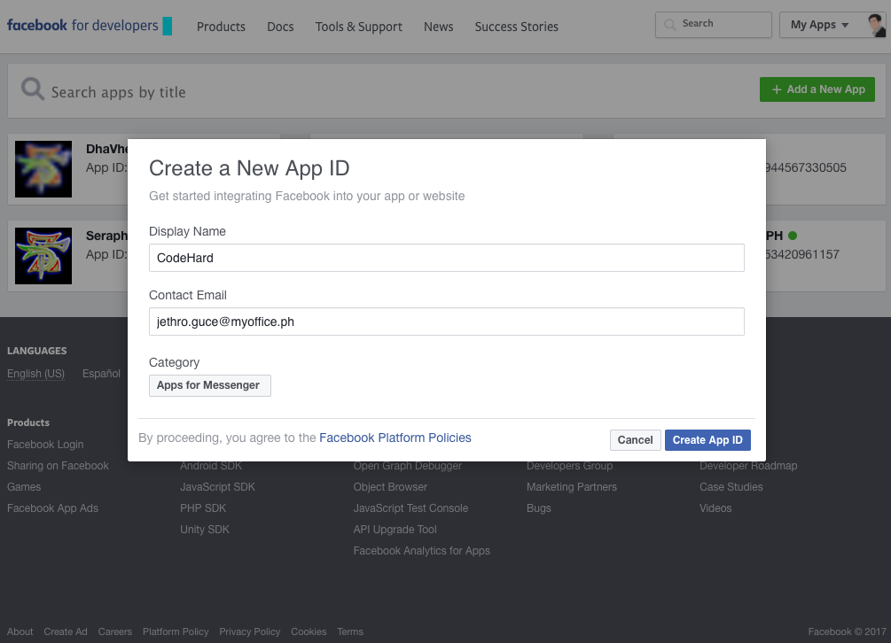
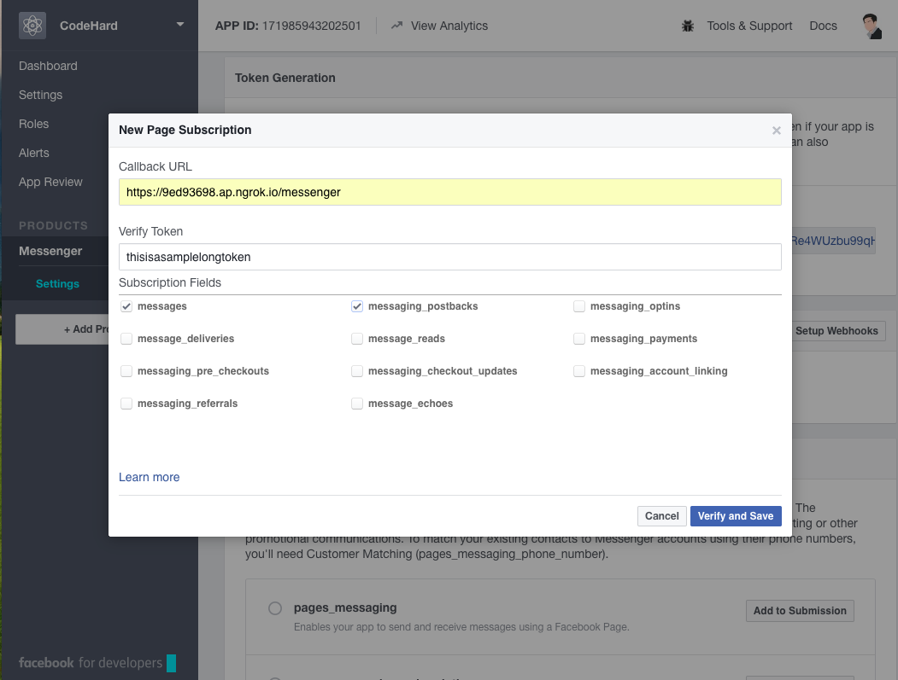
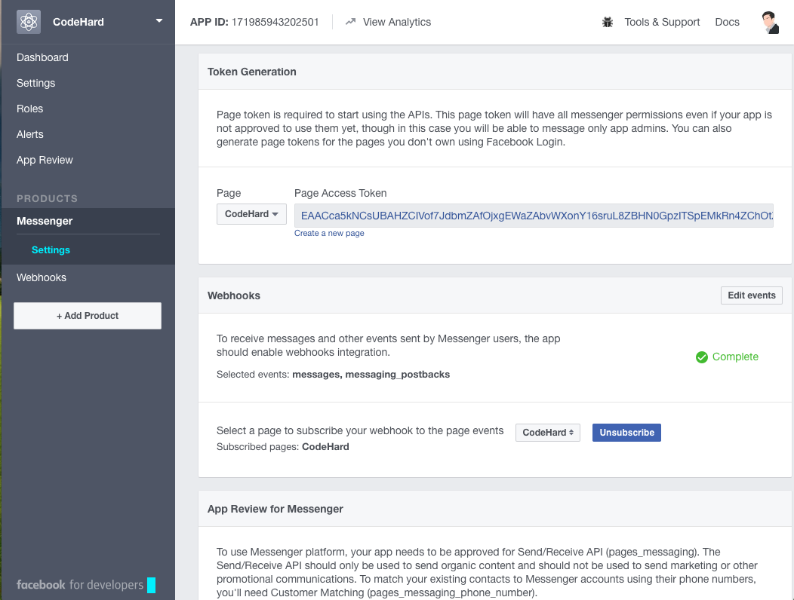

# Introduction
What Is A Chatbot?
A chatbot is a service, powered by rules and sometimes artificial intelligence, that you interact with via a chat interface. The service could be any number of things, ranging from functional to fun.


# Examples of Chat Bots
Here are a couple of other examples:
- Weather bot. Get the weather whenever you ask.
- Grocery bot. Help me pick out and order groceries for the week.
- News bot. Ask it to tell you when ever something interesting happens.
- Life advice bot. I’ll tell it my problems and it helps me think of solutions.
- Personal finance bot. It helps me manage my money better.
- Scheduling bot. Get me a meeting with someone on the Messenger team at Facebook.
- A bot that’s your friend. In China there is a bot called Xiaoice, built by Microsoft, that over 20 million people talk to.

# How Chatbots Work
There are two types of chatbots, one functions based on a set of rules, and the other more advanced version uses machine learning.


__What does this mean?__

## Chatbot that functions based on rules:
- This bot is very very limited. It can only respond to very specific commands. If you say the wrong thing, it doesn’t know what you mean.
- This bot is only as smart as it is programmed to be.

##Chatbot that functions using machine learning:
- This bot has an artificial brain AKA artificial intelligence. You don’t have to be ridiculously specific when you are talking to it. It understands language, not just commands.
- This bot continuously gets smarter as it learns from conversations it has with people.

------

# How To Build Messenger Bot

## Requirements

### [Facebook Page](https://www.facebook.com/pages/create/)
A Facebook Page will be used as the identity of your bot. When people chat with your bot, they will see the Page name and the Page profile pic.

### [Facebook App](https://developers.facebook.com/apps/)
The Facebook App contains the settings. This is where you will setup your webhook, retrieve your page access token and submit your app for approval.



### Get Page Access Token -> FB_PAGE_TOKEN

A Page Access Token is based on an app, page and user and has scopes associated with it. In the developer app, go to the Messenger tab. Select your page and generate a token:

### Webhook Url or WebAPI
We use secure callbacks in order to send you messaging events. These will be sent to your webhook.
- [ngrok.io](https://ngrok.com/download)
- [Python3](https://www.python.org/downloads/)

-----

# Developing Our WebAPI

First we need to set up our application environment. 

#### 1. Create application directory, name it `messenger-bot`.
```
$ mkdir ~/Documents/messenger-bot
$ cd ~/Documents/messenger-bot
```
or
```
> mkdir \pycon2017\messenger-bot
> cd \pycon2017\messenger-bot
```

#### 2. Create a python virtualenvironment
```
messenger-bot$ virtualenv env
messenger-bot$ source env/bin/activate
(env) messenger-bot$ 
```
or 
```
messenger-bot> virtualenv env
messenger-bot> env\Scripts\Activate
(env) messenger-bot> 
```

#### 3. Install python libraries that will need flask, requests
```
(env) messenger-bot$ pip install flask requests
(env) messenger-bot$ pip freeze > requirements.txt
```

#### 4. Open your favorite text editor, and create a file named `application.py`
```python
from flask import Flask, request

app = Flask(__name__)


@app.route('/')
def index():
    return 'Hello World'


if __name__ == '__main__':
    app.run('0.0.0.0', 5000, debug=True)
```

Now open up your browser on `http://localhost:5000` and you should be able to see your web app running.

#### 5. Open a terminal session from where you have downloaded ngrok and start ngrok http service so we can receive requests from the public
```
$ ngrok http 5000 -region ap
```
You should now have 2 open terminals.
And then open your browser and try to access the assigned url, (i.e. `https://9ed93698.ap.ngrok.io`)

#### 6. Set up our messenger webhook
Webhooks are used to send us a variety of different events including messages, authentication events and callback events from messages.
Modify `application.py`
```python
@app.route('/messenger')
def messenger_webhook():
    verify_token = request.args.get('hub.verify_token')
    challenge = request.args.get('hub.challenge')
    print(verify_token)
    if challenge and verify_token == FB_PAGE_TOKEN:
        return challenge
    return 'Invalid Request or Verification Token'
```

In the Messenger Platform tab, find the Webhooks section and click Setup Webhooks. Enter a URL for a webhook, define a Verify Token and select `messages`, and `messaging_postbacks` under Subscription Fields.


At our webhook URL, add code for verification. The code should expect the Verify Token we have previously defined, and respond with the challenge sent back in the verification request. Click the "Verify and Save" button in the New Page Subscription to call the webhook with a GET request.

#### 7. Subscribe App to a Page



Once you have completed these steps, you'll be ready to test your integration and receive messages sent to your Page.

To test you're receiving updates via the Webhook, simply send a message to your page. You can do that from your page on facebook.com, the Facebook mobile app, searching your page on Messenger, or using your Messenger short url https://m.me/PAGE_USERNAME.

If you don't receive an update via your Webhook, please ensure you didn't receive any errors when you setup your Webhook and you subscribed your App to your page.

> Developer Note
> When your app is in Development Mode, plugin and API functionality will only work for admins, developers and testers of the app. After your app is approved and public, it will work for the general public.


#### 8. Receiving Message

Add Support for handling Post requests

Your webhook callback should always return a 200 OK HTTP response when invoked by Facebook. Failing to do so may cause your webhook to be unsubscribed by the Messenger Platform.

```python
@app.route('/messenger', methods=['POST'])
def send_message():
    data = request.json
    print(data)
    return 'OK'
```

All Callbacks for the Messenger Platfor have a common structure.
```json
{
  "object":"page",
  "entry":[
    {
      "id":"PAGE_ID",
      "time":1458692752478,
      "messaging":[
        {
          "sender":{
            "id":"USER_ID"
          },
          "recipient":{
            "id":"PAGE_ID"
          },

          ...
        }
      ]
    }
  ]
}
```


#### 9. Sending Message
Create function to access fb graph api
```python
import requests
...
@app.route('/messenger', methods=['POST'])
def send_message():
    data = request.json
    if data['object'] != 'page':
        return 'Unknown Event'
    for entry in data['entry']:
        messages = entry['messaging']
        message = messages[0]
        if message:
            fb_id = message['sender']['id']
            text = message['message']['text']
            fb_send_message(fb_id, text)
    return 'OK'


def fb_send_message(fb_id, message):
    data = {
        'recipient': {'id': fb_id},
        'message': {'text': message}
    }
    token = 'access_token={}'.format(FB_PAGE_TOKEN)
    url = 'https://graph.facebook.com/v2.6/me/messages?{}'.format(token)
    res = requests.post(url, json=data)
    return res.json()

...

```

#### 10. Other Response Templates


## Tips and Guides
Whether using a bot or implementing live messaging, it’s important to define the experience you want to create for yourself and the people you’re interacting with on Messenger. Before any messages get sent, take the time to:

* __Determine your goals.__ Do you want to design around utility, delight or a mixture of both? Understanding your strategy and what you want to accomplish will help you create the best experience.
* __Decide what you want people to do.__ What actions do you want people to take? Are there multiple tasks you want them to complete? How are those tasks completed outside of Messenger? Determine all the paths people can navigate when designing your interactions.
* __Plan how you’ll evolve.__ Once people complete your tasks, what are some ways you can keep the interaction going? Consider how you can expand your capabilities to grow your experience and extend your lifecycle.
Focus on doing a couple things really well; doing too much creates confusion and dilutes your experience.


## References
- https://developers.facebook.com/blog/post/2016/04/12/bots-for-messenger/
- https://developers.facebook.com/docs/messenger-platform
- https://www.facebook.com/groups/messengerplatform 
- https://wit.ai/docs
- https://chatbotsmagazine.com/
- https://messengerblog.com/
